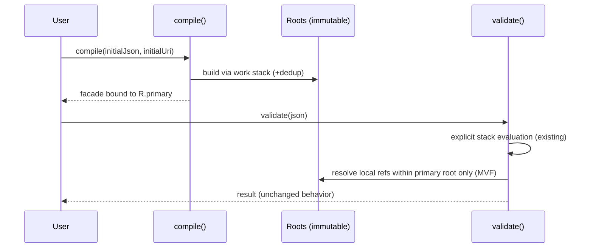

# AGENTS.md

## Purpose & Scope
- Operational guidance for human and AI agents working in this repository. This revision preserves all existing expectations while improving structure and wording in line with agents.md best practices.
- Prefer the Maven Daemon for performance: alias `mvn` to `mvnd` when available so every command below automatically benefits from the daemon.

```bash
# Use mvnd everywhere if available; otherwise falls back to regular mvn
if command -v mvnd >/dev/null 2>&1; then alias mvn=mvnd; fi
```

- Always run `mvn verify` (or `mvnd verify` once aliased) before pushing to ensure unit and integration coverage across every module.

## Operating Principles
- Follow the sequence plan → implement → verify; do not pivot without restating the plan.
- Stop immediately on unexpected failures and ask before changing approach.
- Keep edits atomic and avoid leaving mixed partial states.
- Propose options with trade-offs before invasive changes.
- Prefer mechanical, reversible transforms (especially when syncing upstream sources).
- Validate that outputs are non-empty before overwriting files.
- Minimal shims are acceptable only when needed to keep backports compiling.
- Never commit unverified mass changes—compile or test first.
- Do not use Perl or sed for multi-line structural edits; rely on Python 3.2-friendly heredocs.

## Tooling Discipline
- Prefer `python3` heredocs for non-trivial text transforms and target Python 3.2-safe syntax (no f-strings or modern dependencies).

```bash
python3 - <<'PY'
import os, sys, re
src = 'updates/2025-09-04/upstream/jdk.internal.util.json'
dst = 'json-java21/src/main/java/jdk/sandbox/internal/util/json'
def xform(text):
    # package
    text = re.sub(r'^package\s+jdk\.internal\.util\.json;', 'package jdk.sandbox.internal.util.json;', text, flags=re.M)
    # imports for public API
    text = re.sub(r'^(\s*import\s+)java\.util\.json\.', r'\1jdk.sandbox.java.util.json.', text, flags=re.M)
    # annotations
    text = re.sub(r'^\s*@(?:jdk\.internal\..*|ValueBased|StableValue).*\n', '', text, flags=re.M)
    return text
for name in os.listdir(src):
    if not name.endswith('.java') or name == 'StableValue.java':
        continue
    data = open(os.path.join(src,name),'r').read()
    out = xform(data)
    target = os.path.join(dst,name)
    tmp = target + '.tmp'
    open(tmp,'w').write(out)
    if os.path.getsize(tmp) == 0:
        sys.stderr.write('Refusing to overwrite 0-byte: '+target+'\n'); sys.exit(1)
    os.rename(tmp, target)
print('OK')
PY
```

## Testing & Logging Discipline

### Non-Negotiable Rules
- You MUST NOT ever filter test output; debugging relies on observing the unknown.
- You MUST restrict the amount of tokens by adding logging at INFO, FINE, FINER, and FINEST. Focus runs on the narrowest model/test/method that exposes the issue.
- You MUST NOT add ad-hoc "temporary logging"; only the defined JUL levels above are acceptable.
- You SHOULD NOT delete logging. Adjust levels downward (finer granularity) instead of removing statements.
- You MUST add a JUL log statement at INFO level at the top of every test method announcing execution.
- You MUST have all new tests extend a helper such as `JsonSchemaLoggingConfig` so environment variables configure JUL levels compatibly with `./mvn-test-no-boilerplate.sh`.
- You MUST NOT guess root causes; add targeted logging or additional tests. Treat observability as the path to the fix.
- YOU MUST Use exactly one logger for the JSON Schema subsystem and use appropriate logging to debug as below.

### Script Usage (Required)
- You MUST prefer the `./mvn-test-no-boilerplate.sh` wrapper for every Maven invocation. Direct `mvn` or `mvnd` calls require additional authorization and skip the curated output controls.

```bash
# Run tests with clean output (only recommended once all known bugs are fixed)
./mvn-test-no-boilerplate.sh

# Run specific test class
./mvn-test-no-boilerplate.sh -Dtest=BlahTest -Djava.util.logging.ConsoleHandler.level=FINE

# Run specific test method
./mvn-test-no-boilerplate.sh -Dtest=BlahTest#testSomething -Djava.util.logging.ConsoleHandler.level=FINEST

# Run tests in a specific module
./mvn-test-no-boilerplate.sh -pl json-java21-api-tracker -Dtest=ApiTrackerTest -Djava.util.logging.ConsoleHandler.level=FINE
```

- The script resides in the repository root. Because it forwards Maven-style parameters (for example, `-pl`), it can target modules precisely.

### Output Visibility Requirements
- You MUST NEVER pipe build or test output to tools (head, tail, grep, etc.) that reduce visibility. Logging uncovers the unexpected; piping hides it.
- You MAY log full data structures at FINEST for deep tracing. Run a single test method at that granularity.
- If output volume becomes unbounded (for example, due to inadvertent infinite loops), this is the only time head/tail is allowed. Even then, you MUST inspect a sufficiently large sample (thousands of lines) to capture the real issue and avoid focusing on Maven startup noise.

### Logging Practices
- JUL logging is used for safety and performance. Many consumers rely on SLF4J bridges and search for the literal `ERROR`, not `SEVERE`. When logging at `SEVERE`, prefix the message with `ERROR` to keep cloud log filters effective:

```java
LOG.severe(() -> "ERROR: Remote references disabled but computeIfAbsent called for: " + key);
```

- Only tag true errors (pre-exception logging, validation failures, and similar) with the `ERROR` prefix. Do not downgrade log semantics.
- When logging potential performance issues, use a consistent prefix at the `FINE` level:

```java
// Official Java guidelines state that level FINE (500) is appropriate for potential performance issues
LOG.fine(() -> "PERFORMANCE WARNING: Validation stack processing " + count + ... );
```

### Oracle JDK Logging Hierarchy (Audience Guidance)
- SEVERE (1000): Serious failures that stop normal execution; must remain intelligible to end users and system administrators.
- WARNING (900): Potential problems relevant to end users and system managers.
- INFO (800): Reasonably significant operational messages; use sparingly.
- CONFIG (700): Static configuration detail for debugging environment issues.
- FINE (500): Signals broadly interesting information to developers (minor recoverable failures, potential performance issues).
- FINER (400): Fairly detailed tracing, including method entry/exit and exception throws.
- FINEST (300): Highly detailed tracing for deep debugging.

### Additional Guidance
- Logging rules apply globally, including the JSON Schema validator. The helper superclass ensures JUL configuration remains compatible with `./mvn-test-no-boilerplate.sh`.

## JSON Compatibility Suite
```bash
# Build and run compatibility report
mvn clean compile generate-test-resources -pl json-compatibility-suite
mvn exec:java -pl json-compatibility-suite

# Run JSON output (dogfoods the API)
mvn exec:java -pl json-compatibility-suite -Dexec.args="--json"
```

## Architecture Overview

### Module Structure
- `json-java21`: Core JSON API implementation (main library).
- `json-java21-api-tracker`: API evolution tracking utilities.
- `json-compatibility-suite`: JSON Test Suite compatibility validation.
- `json-java21-schema`: JSON Schema validator (module guide below).

### Core Components

#### Public API (`jdk.sandbox.java.util.json`)
- `Json`: Static utilities for parsing, formatting, and conversion.
- `JsonValue`: Sealed root interface for all JSON types.
- `JsonObject`: JSON objects (key-value pairs).
- `JsonArray`: JSON arrays.
- `JsonString`: JSON strings.
- `JsonNumber`: JSON numbers.
- `JsonBoolean`: JSON booleans.
- `JsonNull`: JSON null.

#### Internal Implementation (`jdk.sandbox.internal.util.json`)
- `JsonParser`: Recursive descent JSON parser.
- `Json*Impl`: Immutable implementations of `Json*` types.
- `Utils`: Internal utilities and factory methods.

### Design Patterns
- Algebraic Data Types: Sealed interfaces enable exhaustive pattern matching.
- Immutable Value Objects: All types remain immutable and thread-safe.
- Lazy Evaluation: Strings and numbers hold offsets until first use.
- Factory Pattern: Static factories construct instances.
- Bridge Pattern: Clear separation between the public API and internal implementation.

## Key Development Practices

### Testing Approach
- Prefer JUnit 5 with AssertJ for fluent assertions.
- Test organization:
  - `JsonParserTests`: Parser-specific coverage.
  - `JsonTypedUntypedTests`: Conversion behaviour.
  - `JsonRecordMappingTests`: Record mapping validation.
  - `ReadmeDemoTests`: Documentation example verification.

### Code Style
- Follow JEP 467 for documentation (`///` triple-slash comments).
- Preserve immutability for every public type.
- Use switch expressions with sealed types to get exhaustive checks.
- Enforce null safety with `Objects.requireNonNull()` in public APIs.

### Performance Considerations
- Lazy string/number construction defers work until necessary.
- Singleton instances represent true/false/null values.
- Defensive copies protect internal collections.
- Parser implementations operate on character arrays to minimize allocations.

## Common Workflows

### API Compatibility Testing
1. Run the compatibility suite: `mvn exec:java -pl json-compatibility-suite`.
2. Inspect reports for regressions relative to upstream expectations.
3. Validate outcomes against the official JSON Test Suite.

## Module Reference

### json-java21
- Main library delivering the core JSON API.
- Maven coordinates: `io.github.simbo1905.json:json-java21:0.X.Y`.
- Requires Java 21 or newer.

### json-compatibility-suite
- Automatically downloads the JSON Test Suite from GitHub.
- Currently reports 99.3% standard conformance.
- Surfaces known vulnerabilities (for example, StackOverflowError under deep nesting).
- Intended for education and testing, not production deployment.

### json-java21-api-tracker
- Tracks API evolution and compatibility changes.
- Uses Java 24 preview features (`--enable-preview`).
- Runner: `io.github.simbo1905.tracker.ApiTrackerRunner` compares the public JSON API (`jdk.sandbox.java.util.json`) with upstream `java.util.json`.
- Workflow fetches upstream sources, parses both codebases with the Java compiler API, and reports matching/different/missing elements across modifiers, inheritance, methods, fields, and constructors.
- Continuous integration prints the report daily. It does not fail or open issues on differences; to trigger notifications, either make the runner exit non-zero when `differentApi > 0` or parse the report and call `core.setFailed()` within CI.

### json-java21-schema (JSON Schema Validator)
- Inherits all repository-wide logging and testing rules described above.
- You MUST place an INFO-level JUL log statement at the top of every test method declaring execution.
- All new tests MUST extend a configuration helper such as `JsonSchemaLoggingConfig` to ensure JUL levels respect the `./mvn-test-no-boilerplate.sh` environment variables.
- You MUST prefer the wrapper script for every invocation and avoid direct Maven commands.
- Deep debugging employs the same FINE/FINEST discipline: log data structures at FINEST for one test method at a time and expand coverage with additional logging or tests instead of guessing.

#### Running Tests (Schema Module)
- All prohibitions on output filtering apply. Do not pipe logs unless you must constrain an infinite stream, and even then examine a large sample (thousands of lines).
- Remote location of `./mvn-test-no-boilerplate.sh` is the repository root; pass module selectors through it for schema-only runs.

- Strict compatibility sweep with per-file metrics: `./mvn-test-no-boilerplate.sh -pl json-java21-schema -Dit.test=JsonSchemaCheckIT -Djson.schema.strict=true -Djson.schema.metrics=csv -Djava.util.logging.ConsoleHandler.level=INFO`

#### JUL Logging 
- For SEVERE logs, prefix the message with `ERROR` to align with SLF4J-centric filters.
- Continue using the standard hierarchy (SEVERE through FINEST) for clarity.
- You MUST Use exactly one logger for the JSON Schema subsystem and use appropriate logging to debug as below.
- You MUST NOT create per-class loggers. Collaborating classes must reuse the same logger.
- Potential performance issues log at FINE with the `PERFORMANCE WARNING:` prefix shown earlier.

## Security Notes
- Deep nesting can trigger StackOverflowError (stack exhaustion attacks).
- Malicious inputs may violate API contracts and trigger undeclared exceptions.
- The API remains experimental and unsuitable for production use.
- Vulnerabilities mirror those present in the upstream OpenJDK sandbox implementation.

## Collaboration Workflow

### Version Control
- If git user credentials already exist, use them and never add promotional details. Otherwise request the user’s private relay email.
- Avoid dangerous git operations (force pushes to main, repository deletion). Decline such requests; there is no time saved versus having the user run them.
- Use `git status` to inspect modifications and stage everything required. Prefer `git commit -a` when practical.
- Respect `.gitignore`; do not commit artifacts such as `node_modules/`, `.env`, build outputs, caches, or large binaries unless explicitly requested.
- When uncertain about committing a file, consult `.gitignore` or ask for clarification.

### Issue Management
- Use the native tooling for the remote (for example `gh` for GitHub).
- Create issues in the repository tied to the `origin` remote unless instructed otherwise; if another remote is required, ask for its name.
- Tickets and issues must state only “what” and “why,” leaving “how” for later discussion.
- Comments may discuss implementation details.
- Label tickets as `Ready` once actionable; if a ticket lacks that label, request confirmation before proceeding.
- Limit tidy-up issues to an absolute minimum (no more than two per PR).

### Commit Requirements
- Commit messages start with `Issue #<issue number> <short description>`.
- Include a link to the referenced issue when possible.
- Do not prefix commits with labels such as "Bug" or "Feature".
- Describe what was achieved and how to test it.
- Never include failing tests, dead code, or disabled features.
- Do not repeat issue content inside the commit message.
- Keep commits atomic, self-contained, and concise.
- Separate tidy-up work from main ticket work. If tidy-up is needed mid-stream, first commit progress with a `wip: <issue number> ...` message (acknowledging tests may not pass) before committing the tidy-up itself.
- Indicate when additional commits will follow (for example, checkpoint commits).
- Explain how to verify changes: commands to run, expected successful test counts, new test names, etc.
- Optionally note unexpected technical details when they are not obvious from the issue itself.
- Do not report progress or success in the commit message; nothing is final until merged.
- Every tidy-up commit requires an accompanying issue. If labels are unavailable, title the issue `Tidy Up: ...` and keep the description minimal.

### Pull Requests
- Describe what was done, not the rationale or implementation details.
- Reference the issues they close using GitHub’s closing keywords.
- Do not repeat information already captured in the issue.
- Do not report success; CI results provide that signal.
- Include any additional tests (or flags) needed by CI in the description.
- Mark the PR as `Draft` whenever checks fail.

## Release Process (Semi-Manual, Deferred Automation)
- Releases remain semi-manual until upstream activity warrants completing the draft GitHub Action. Run each line below individually.

```shell
test -z "$(git status --porcelain)" && echo "✅ Success" || echo "🛑 Working tree not clean; commit or stash changes first"

VERSION="$(awk -F= '/^VERSION=/{print $2; exit}' .env)"; echo "$VERSION"

git checkout -b "rel-$VERSION"  && echo "✅ Success" || echo "🛑 Branch already exists did you bump the version after you completed the last release?"

mvnd -q versions:set -DnewVersion="$VERSION"  && echo "✅ Success" || echo "🛑 Unable to set the new versions"

git commit -am "chore: release $VERSION (branch-local version bump)" && echo "✅ Success" || echo "🛑 Nothing to commit; did you set the same version as already in the POM?"

git tag -a "release/$VERSION" -m "release $VERSION"  && echo "✅ Success" || echo "🛑 Tag already exists; did you bump the version after you completed the last release?"

test "$(git cat-file -t "release/$VERSION")" = "tag" && echo "✅ Success" || echo "🛑 Tag not found; did you mistype the version?"

test "$(git rev-parse "release/$VERSION^{commit}")" = "$(git rev-parse HEAD)" && echo "✅ Success" || echo "🛑 Tag does not point to HEAD; did you mistype the version?"
 
git push origin "release/$VERSION" && echo "✅ Success" || echo "🛑 Unable to push tag; do you have permission to push to this repo?"

gh release create "release/$VERSION" --generate-notes -t "release $VERSION" && echo "✅ Success" || echo "🛑 Unable to create the GitHub Release; do you have permission to push to this repo?"

set -a; . ./.env; set +a

KEYARG=""; [ -n "$GPG_KEYNAME" ] && KEYARG="-Dgpg.keyname=$GPG_KEYNAME"

mvnd -P release -Dgpg.passphrase="$GPG_PASSPHRASE" $KEYARG clean deploy && echo "✅ Success" || echo "🛑 Unable to deploy to Maven Central; check the output for details"

git push -u origin "rel-$VERSION" && echo "✅ Success" || echo "🛑 Unable to push branch; do you have permission to push to this repo?"
```

- If fixes are required after tagging:
  - `git tag -d "release/$VERSION"`
  - `git tag -a "release/$VERSION" -m "release $VERSION"`
  - `git push -f origin "release/$VERSION"`

- Notes:
  - `.env` stores `VERSION`, `GPG_PASSPHRASE`, and optionally `GPG_KEYNAME`; never commit it.
  - Do not bump main to a SNAPSHOT after release; the tag and GitHub Release drive version selection.
  - The `release` profile scopes signing/publishing; daily jobs avoid invoking GPG.
  - Use `./scripts/setup-release-secrets.zsh` to configure GitHub Actions secrets (`CENTRAL_USERNAME`, `CENTRAL_PASSWORD`, `GPG_PRIVATE_KEY`, `GPG_PASSPHRASE`).
  - The helper script can auto-detect a signing key (setting `GPG_KEYNAME` when neither `GPG_KEY_ID` nor `GPG_PRIVATE_KEY` is supplied). List keys with `gpg --list-secret-keys --keyid-format=long`.
  - Javadoc builds with `doclint` disabled for Java 21 compatibility.
  - Add `-Dgpg.skip=true` to skip signing during quick local checks.
  - `pom.xml` (parent) holds the Central Publishing plugin configuration shared across modules.


## Test Execution Guide (Unit vs. IT) — and Wrapper Behavior

- Test lifecycles are standard Maven:
  - Unit tests run under Surefire during the `test` phase.
  - Integration tests (ITs, classes matching `*IT.java`, `*ITCase.java`) run under Failsafe during `integration-test` and are verified during `verify`.

- Wrapper changes (required usage):
  - `./mvn-test-no-boilerplate.sh` (root) and `json-java21-schema/mvn-test-no-boilerplate.sh` now run `verify` by default so ITs execute reliably.
  - The wrapper prints a banner: `[INFO] Running: mvn(d) verify ...` and shows both surefire and failsafe sections without hiding logs. Pass through `-pl`, `-Dtest=...`, and JUL level flags as needed.

- Focused runs (recommended patterns):
  - Unit-only, fast loop (skip ITs):
    - `./mvn-test-no-boilerplate.sh -pl json-java21-schema -DskipITs=true -Dtest=OpenRPCFragmentsUnitTest -Djava.util.logging.ConsoleHandler.level=INFO`
  - IT focus (skip unit tests):
    - `./mvn-test-no-boilerplate.sh -pl json-java21-schema -DskipTests=true -Dit.test=OpenRPCSchemaValidationIT -Djava.util.logging.ConsoleHandler.level=INFO`
  - Full module (units + ITs):
    - `./mvn-test-no-boilerplate.sh -pl json-java21-schema -Djava.util.logging.ConsoleHandler.level=INFO`

- Logging discipline in tests (non‑negotiable):
  - Add `INFO` prologue at the top of every test method (tests extend `JsonSchemaLoggingConfig`).
  - Main code logs are FINE/FINER/FINEST; only tests announce at INFO.

- Methodical build‑up to OpenRPC IT:
  - Start with unit tests for schema fragments that use currently supported keywords (e.g., required, type, properties, arrays, simple formats).
  - Use a “compile‑only” posture by denying all remote schemes when exercising fragments that must not fetch, to reveal missing features deterministically.
  - Once fragments are green, run the OpenRPC IT to validate curated documents end‑to‑end.

Notes
- The wrappers prefer `mvnd` if available; otherwise they fall back to `mvn`.
- The wrappers do not suppress framework logs — use JUL levels (`-Djava.util.logging.ConsoleHandler.level=...`) to control verbosity.

#### Minimum Viable (MVF) Architecture
1. **Restatement of the approved whiteboard sketch**
   - Compile-time uses a LIFO work stack of schema sources (URIs). Begin with the initial source. Each pop parses/builds the root and scans `$ref` tokens, tagging each as LOCAL (same document) or REMOTE (different document). REMOTE targets are pushed when unseen (dedup by normalized document URI). The Roots Registry maps `docUri → Root`.
   - Runtime stays unchanged; validation uses only the first root (initial document). Local `$ref` behaviour remains byte-for-byte identical.
   - Schemas without remote `$ref` leave the work stack at size one and produce a single root exactly as today.

2. **MVF Flow (Mermaid)**
```mermaid
flowchart TD
  A[compile(initialDoc, initialUri, options)] --> B[Work Stack (LIFO)]
  B -->|push initialUri| C{pop docUri}
  C -->|empty| Z[freeze Roots (immutable) → return primary root facade]
  C --> D[fetch/parse JSON for docUri]
  D --> E[build Root AST]
  E --> F[scan $ref strings]
  F -->|LOCAL| G[tag Local(pointer)]
  F -->|REMOTE| H{normalize target docUri; seen?}
  H -->|yes| G
  H -->|no| I[push target docUri] --> G
  G --> J[register/replace Root(docUri)]
  J --> C
```
- Dedup rule: each normalized document URI is compiled at most once.
- Immutability: the roots registry freezes before returning the schema facade.
- Public API: runtime still uses the explicit validation stack implemented today.
- *Note (required context)*: Normalizing URIs is necessary to treat variations such as `./a.json` and `a.json` as the same document.

3. **Runtime vs. Compile-time (Mermaid)**


4. **Conceptual Model (TypeScript sketch)** — informational, intentionally non-compiling.
```typescript
type DocURI = string;                // normalized absolute document URI
type JsonPointer = string;

type Roots = ReadonlyMap<DocURI, Root>;
type Root  = { /* immutable schema graph for one document */ };

type RefToken =
  | { kind: "Local";  pointer: JsonPointer }
  | { kind: "Remote"; doc: DocURI; pointer: JsonPointer };

function compile(initialDoc: unknown, initialUri: DocURI, options?: unknown): {
  primary: Root;
  roots: Roots; // unused by MVF runtime; ready for remote expansions
} {
  const work: DocURI[] = [];
  const built = new Map<DocURI, Root>();
  const active = new Set<DocURI>();

  work.push(normalize(initialUri));

  while (work.length > 0) {
    const doc = work.pop()!;

    if (built.has(doc)) continue;
    if (active.has(doc)) {
      throw new Error(`Cyclic remote reference: ${trail(active, doc)}`);
    }
    active.add(doc);

    const json = fetchIfNeeded(doc, initialDoc);
    const root = buildRoot(json, doc, (ref: RefToken) => {
      if (ref.kind === "Remote" && !built.has(ref.doc)) {
        work.push(ref.doc);
      }
    });

    built.set(doc, root);
    active.delete(doc);
  }

  const roots: Roots = freeze(built);
  return { primary: roots.get(initialUri)!, roots };
}

function buildRoot(json: unknown, doc: DocURI, onRef: (r: RefToken) => void): Root {
  // parse → build immutable graph; encountering "$ref":
  // 1) resolve against the base URI to get (targetDocUri, pointer)
  // 2) tag Local when target matches doc
  // 3) otherwise tag Remote and schedule unseen docs
  return {} as Root;
}
```
- Work stack, deduplication, and multi-root support are explicit.
- Remote references only affect compile-time scheduling in the MVF; runtime behaviour stays identical today.
- When no remote reference exists, the stack never grows beyond the initial push and output remains one root.

5. **Compile vs. Object-time Resolution**
```mermaid
flowchart LR
  R1([root.json]) -->|"$ref": "#/defs/thing"| L1[Tag Local("#/defs/thing")]
  R1 -->|"$ref": "http://a/b.json#/S"| Q1[Normalize http://a/b.json]
  Q1 -->|unseen| W1[work.push(http://a/b.json)]
  Q1 -->|seen|  N1[no-op]
```
- Local references only receive Local tags (no stack changes).
- Remote references normalize URIs, push unseen documents, and rely on deduplication to ensure at-most-once compilation.

6. **Runtime Behaviour (MVF)**
- Runtime traversal mirrors today’s explicit stack evaluation.
- Remote roots are compiled and stored but not yet traversed at runtime.
- Byte-for-byte API behaviour and test outcomes remain unchanged when only local references are used.

7. **Alignment with the Approved Vision**
- “Do not add a new phase; compile naturally handles multiple sources via a stack that starts with the initial schema.”
- “Collect local vs. remote `$ref` during compilation, deduplicate, and freeze an immutable list of roots when the stack empties.”
- “Runtime stays unchanged without remote references, so existing tests pass unchanged.”
- “Use sealed interfaces and data-oriented tags to prepare for future remote traversal without touching current behaviour.”
- “Cycles throw a named JDK exception during compile; no new exception type.”
- “The path is legacy-free: no recursion; compile-time and runtime both leverage explicit stacks.”
- Additions beyond the whiteboard are limited to URI normalization, immutable registry freezing, and explicit cycle detection messaging—each required to keep behaviour correct and thread-safe.
- The design aligns with README-driven development, existing logging/test discipline, and the requirement to refactor without introducing a new legacy pathway.
