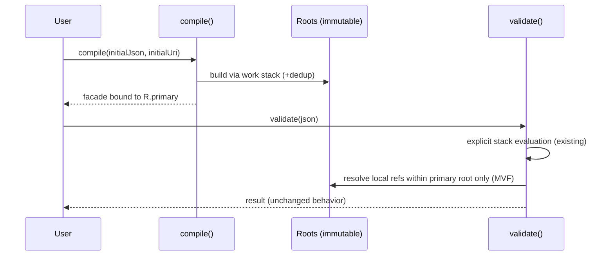

# AGENTS.md

## Purpose & Scope
- Operational guidance for human and AI agents working in this repository. This revision preserves all existing expectations while improving structure and wording in line with agents.md best practices.

User-facing documentation lives in `README.md`. Keep this file focused on contributor/agent workflow, debugging, and coding standards.

## Operating Principles
- Follow the sequence plan → implement → verify; do not pivot without restating the plan.
- Stop immediately on unexpected failures and ask before changing approach.
- Keep edits atomic and avoid leaving mixed partial states.
- You SHOULD discuss trade-offs before making invasive changes to existing code.
- Prefer mechanical, reversible transforms (especially when syncing upstream sources).
- Validate that outputs are non-empty before overwriting files.
- Minimal shims are acceptable only when needed to keep backports compiling.
- Never commit unverified mass changes—compile or test first.
- Do not use Perl or sed for multi-line structural edits; rely on Python 3.2-friendly heredocs.

## Markdown-Driven-Development (MDD)
We practice **Markdown-Driven-Development** where documentation precedes implementation:

1. **Create GitHub issue** with clear problem statement and goals
2. **Update user documentation** (README.md) with new behavior/semantics
3. **Update agentic documentation** (AGENTS.md) with implementation guidance
4. **Update specialist documentation** (**/*.md, e.g., ARCHITECTURE.md) as needed
5. **Create implementation plan** (PLAN_${issue_id}.md) documenting exact changes
6. **Implement code changes** to match documented behavior
7. **Update tests** to validate the documented behavior
8. **Verify all documentation** remains accurate after implementation

This ensures:
- Users understand behavior changes before code is written
- Developers have clear implementation guidance
- Documentation stays synchronized with code
- Breaking changes are clearly communicated

When making changes, always update documentation files before modifying code.


## Testing & Logging Discipline

### Non-Negotiable Rules
- You MUST NOT ever filter test output; debugging relies on observing the unknown.
- You MUST restrict the amount of tokens by adding logging at INFO, FINE, FINER, and FINEST. Focus runs on the narrowest model/test/method that exposes the issue.
- You MUST NOT add ad-hoc "temporary logging"; only the defined JUL levels above are acceptable.
- You SHOULD NOT delete logging. Adjust levels downward (finer granularity) instead of removing statements.
- You MUST add a JUL log statement at INFO level at the top of every test method announcing execution.
- You MUST have all new tests extend a helper such as `JsonSchemaLoggingConfig` so environment variables configure JUL levels compatibly with `$(command -v mvnd || command -v mvn || command -v ./mvnw)`.
- You MUST NOT guess root causes; add targeted logging or additional tests. Treat observability as the path to the fix.
- YOU MUST Use exactly one logger for the JSON Schema subsystem and use appropriate logging to debug as below.
- YOU MUST honour official JUL logging levels:
  -	SEVERE (1000): Critical errors—application will likely abort.
  -	WARNING (900): Indications of potential problems or recoverable issues.
  -	INFO (800): Routine events or significant application milestones.
  -	CONFIG (700): Static configuration messages (startup configs, environment details).
  -	FINE (500): General tracing of program flow (basic debug info).
  -	FINER (400): More detailed tracing than FINE (algorithm steps, loop iterations).
  -	FINEST (300): Highly detailed debugging, including variable values and low-level logic.

### Run Tests With Valid Logging

- You MUST prefer the `$(command -v mvnd || command -v mvn || command -v ./mvnw)` wrapper for every Maven invocation.
- You MUST pass in a `java.util.logging.ConsoleHandler.level` of INFO or more low-level.
- You SHOULD run all tests in all models or a given `-pl mvn_moduue` passing `-Djava.util.logging.ConsoleHandler.level=INFO` to see which tests run and which tests might hang 
- You SHOULD run a single test class using `-Dtest=BlahTest -Djava.util.logging.ConsoleHandler.level=FINE` as fine will show you basic debug info
- You SHOULD run a single failing test method using `-Dtest=BlahTest -Djava.util.logging.ConsoleHandler.level=FINER`  
- If you have run a test more than once and about to start guessing you MAY run a single failing test method using `-Dtest=BlahTest -Djava.util.logging.ConsoleHandler.level=FINEST` after ensuring you have added in detail logging of the data structures. 
- You MUST not remove logging yet you may move it to be a finer level. 

```bash
# Run tests with clean output (only recommended once all known bugs are fixed)
$(command -v mvnd || command -v mvn || command -v ./mvnw) test -Djava.util.logging.ConsoleHandler.level=INFO

# Run specific test class you should use FINE
$(command -v mvnd || command -v mvn || command -v ./mvnw) -Dtest=BlahTest -Djava.util.logging.ConsoleHandler.level=FINE

# Run specific test method
$(command -v mvnd || command -v mvn || command -v ./mvnw) -Dtest=BlahTest#testSomething -Djava.util.logging.ConsoleHandler.level=FINEST

# Run tests in a specific module
$(command -v mvnd || command -v mvn || command -v ./mvnw) -pl json-java21-api-tracker -Dtest=ApiTrackerTest -Djava.util.logging.ConsoleHandler.level=FINE
```

IMPORTANT: Fix the method with FINEST logging, then fix the test class with FINER logging, then fix the module with FINE logging, then run the whole suite with INFO logging. THERE IS NO TRIVIAL LOGIC LEFT IN THIS PROJECT TO BE SYSTEMATIC. 

### Output Visibility Requirements

- You MUST NEVER pipe build or test output to tools (head, tail, grep, etc.) that reduce visibility. Logging uncovers the unexpected; piping hides it. Use the instructions above to zoom in on what you want to see using `-Dtest=BlahTest` and `-Dtest=BlahTest#testSomething` passing the appropriate `Djava.util.logging.ConsoleHandler.level=XXX` to avoid too much outputs
- You MAY log full data structures at FINEST for deep tracing. Run a single test method at that granularity.
- If output volume becomes unbounded (for example, due to inadvertent infinite loops), this is the only time head/tail is allowed. Even then, you MUST inspect a sufficiently large sample (thousands of lines) to capture the real issue and avoid focusing on Maven startup noise.
- My time is far more precious than yours do not error on the side of less information and thrash around guessing. You MUST add more logging and look harder! 
- Deep debugging employs the same FINE/FINEST discipline: log data structures at FINEST for one test method at a time and expand coverage with additional logging or tests instead of guessing.

### Logging Practices
- JUL logging is used for safety and performance. Many consumers rely on SLF4J bridges and search for the literal `ERROR`, not `SEVERE`. When logging at `SEVERE`, prefix the message with `ERROR` to keep cloud log filters effective:

```java
LOG.severe(() -> "ERROR: Remote references disabled but computeIfAbsent called for: " + key);
```

- Only tag true errors (pre-exception logging, validation failures, and similar) with the `ERROR` prefix. Do not downgrade log semantics.
- When logging potential performance issues, use a consistent prefix at the `FINE` level:

```java
// Official Java guidelines state that level FINE (500) is appropriate for potential performance issues
LOG.fine(() -> "PERFORMANCE WARNING: Validation stack processing " + count + ... );
```

### Additional Guidance
- Logging rules apply globally. The helper superclass ensures JUL configuration remains compatible with `$(command -v mvnd || command -v mvn || command -v ./mvnw)`.

### Error Message Standards
When throwing exceptions for invalid schemas, provide descriptive error messages that help users understand:
- What specific constraint was violated
- The actual value or structure that caused the problem
- The expected valid format or values

**Good Error Messages:**
```java
// Include the actual invalid value
throw new IllegalArgumentException("enum contains duplicate values: " + 
    values.stream().collect(Collectors.joining(", ", "[", "]")));

// Include the problematic schema portion
throw new IllegalArgumentException("Type schema contains unknown key: " + key + 
    " in schema: " + Json.toDisplayString(obj, 0));

// Include both expected and actual values
throw new IllegalArgumentException("unknown type: '" + typeStr + 
    "', expected one of: boolean, string, timestamp, int8, uint8, int16, uint16, int32, uint32, float32, float64");
```

**Poor Error Messages (Avoid):**
```java
throw new IllegalArgumentException("enum contains duplicate values"); // No context
throw new IllegalArgumentException("invalid schema"); // Too vague
throw new IllegalArgumentException("bad value"); // No specifics
```

Use `Json.toDisplayString(value, depth)` to render JSON fragments in error messages, and include relevant context like schema paths, actual vs expected values, and specific constraint violations.

## JSON Compatibility Suite

See `README.md` for user-facing commands. When running locally as an agent, use the Maven wrapper described in this file.

## Architecture Overview

### Module Structure
- `json-java21`: Core JSON API implementation (main library).
- `json-java21-api-tracker`: API evolution tracking utilities.
- `json-compatibility-suite`: JSON Test Suite compatibility validation.
- `json-java21-jtd`: JSON Type Definition (JTD) validator based on RFC 8927.

### Core Components

#### Public API (`jdk.sandbox.java.util.json`)
- `Json`: Static utilities for parsing, formatting, and conversion.
- `JsonValue`: Sealed root interface for all JSON types.
- `JsonObject`: JSON objects (key-value pairs).
- `JsonArray`: JSON arrays.
- `JsonString`: JSON strings.
- `JsonNumber`: JSON numbers.
- `JsonBoolean`: JSON booleans.
- `JsonNull`: JSON null.

IMPORTANT: This API **MUST NOT** deviate from the upstream jdk.sandbox repo which is will track.  

#### Internal Implementation (`jdk.sandbox.internal.util.json`)
- `JsonParser`: Recursive descent JSON parser.
- `Json*Impl`: Immutable implementations of `Json*` types.
- `Utils`: Internal utilities and factory methods.

IMPORTANT: Bugs in the main logic this code cannot be fixed in this repo they **MUST** be fixed upstream. Only bugs in any backporting machinery such as the double-check-locking class that is a polyfill for a future JDK `@StableValue` feature may be fixed in this repo. 

### Design Patterns
- Algebraic Data Types: Sealed interfaces enable exhaustive pattern matching.
- Immutable Value Objects: All types remain immutable and thread-safe.
- Lazy Evaluation: Strings and numbers hold offsets until first use.
- Factory Pattern: Static factories construct instances.
- Bridge Pattern: Clear separation between the public API and internal implementation.

## Key Development Practices

### Testing Approach
- Prefer JUnit 5 with AssertJ for fluent assertions.

### Code Style
- Follow JEP 467 for documentation (`///` triple-slash comments).
- Preserve immutability for every public type.
- Use switch expressions with sealed types to get exhaustive checks.
- Enforce null safety with `Objects.requireNonNull()` in public APIs.

### Performance Considerations
- Lazy string/number construction defers work until necessary.
- Singleton instances represent true/false/null values.
- Defensive copies protect internal collections.
- Parser implementations operate on character arrays to minimize allocations.

## Common Workflows

Prefer linking to `README.md` for stable, user-facing workflows and module descriptions. Keep this file focused on agent execution details.

#### Debugging Exhaustive Property Tests

The `JtdExhaustiveTest` uses jqwik property-based testing to generate comprehensive schema/document permutations. When debugging failures:

1. **Enable FINEST logging** to capture exact schema and document inputs:
   ```bash
   $(command -v mvnd || command -v mvn || command -v ./mvnw) -pl json-java21-jtd test -Dtest=JtdExhaustiveTest -Djava.util.logging.ConsoleHandler.level=FINEST > test_debug.log 2>&1
   ```

2. **Search for failing cases** in the log file:
   ```bash
   rg "UNEXPECTED: Failing document passed validation" test_debug.log
   ```

3. **Extract the exact schema and document** from the log output and add them as specific test cases to `TestRfc8927.java` for targeted debugging.

The property test logs at FINEST level:
- Schema JSON under test
- Generated documents (both compliant and failing cases)  
- Validation results with detailed error messages
- Unexpected pass/fail results with full context

## Security Notes
- Deep nesting can trigger StackOverflowError (stack exhaustion attacks).
- Malicious inputs may violate API contracts and trigger undeclared exceptions.
- The API remains experimental and unsuitable for production use.
- Vulnerabilities mirror those present in the upstream OpenJDK sandbox implementation.

## Collaboration Workflow

### Version Control
- If git user credentials already exist, use them and never add promotional details. Otherwise request the user’s private relay email.
- Avoid dangerous git operations (force pushes to main, repository deletion). Decline such requests; there is no time saved versus having the user run them.
- Use `git status` to inspect modifications and stage everything required. Prefer `git commit -a` when practical.
- Respect `.gitignore`; do not commit artifacts such as `node_modules/`, `.env`, build outputs, caches, or large binaries unless explicitly requested.
- When uncertain about committing a file, consult `.gitignore` or ask for clarification.

### Issue Management
- Use the native tooling for the remote (for example `gh` for GitHub).
- Create issues in the repository tied to the `origin` remote unless instructed otherwise; if another remote is required, ask for its name.
- Tickets and issues must state only "what" and "why," leaving "how" for later discussion.
- Comments may discuss implementation details.
- Label tickets as `Ready` once actionable; if a ticket lacks that label, request confirmation before proceeding.
- Limit tidy-up issues to an absolute minimum (no more than two per PR).

### Creating GitHub Issues
- **Title requirements**: No issue numbers, no special characters, no quotes, no shell metacharacters
- **Body requirements**: Write issue body to a file first, then use --body-file flag
- **Example workflow**:
  ```bash
  echo "Issue description here" > /tmp/issue_body.md
  gh issue create --title "Brief description of bug" --body-file /tmp/issue_body.md
  ```
- **Never use --body flag** with complex content - always use --body-file to avoid shell escaping issues

### Commit Requirements
- Commit messages start with `Issue #<issue number> <short description>`.
- Include a link to the referenced issue when possible.
- Do not prefix commits with labels such as "Bug" or "Feature".
- Describe what was achieved and how to test it.
- Never include failing tests, dead code, or disabled features.
- Do not repeat issue content inside the commit message.
- Keep commits atomic, self-contained, and concise.
- Separate tidy-up work from main ticket work. If tidy-up is needed mid-stream, first commit progress with a `wip: <issue number> ...` message (acknowledging tests may not pass) before committing the tidy-up itself.
- Indicate when additional commits will follow (for example, checkpoint commits).
- Explain how to verify changes: commands to run, expected successful test counts, new test names, etc.
- Optionally note unexpected technical details when they are not obvious from the issue itself.
- Do not report progress or success in the commit message; nothing is final until merged.
- Every tidy-up commit requires an accompanying issue. If labels are unavailable, title the issue `Tidy Up: ...` and keep the description minimal.
- **Do not include advertising or promotional content** such as `🤖 Generated with [XXX YYY](https://XXX/YYY)` in commit messages.
- **Do not add 'Co-Authored-By' comments** to commit messages; keep attribution within the normal git author fields.

### Pull Requests
- Describe what was done, not the rationale or implementation details.
- Reference the issues they close using GitHub's closing keywords.
- Do not repeat information already captured in the issue.
- Do not report success; CI results provide that signal.
- Include any additional tests (or flags) needed by CI in the description.
- Mark the PR as `Draft` whenever checks fail.

### Creating Pull Requests with GitHub CLI
- Use simple titles without special characters or emojis
- Write PR body to a file first to avoid shell escaping issues
- Use `--body-file` flag instead of `--body` for complex content
- Example: `gh pr create --title "Fix validation bug" --body-file /tmp/pr_body.md`
- Watch CI checks with `gh pr checks --watch` until all pass
- Do not merge until all checks are green

## Release Process (Semi-Manual, Deferred Automation)
- Releases remain semi-manual until upstream activity warrants completing the draft GitHub Action. Run each line below individually.

```shell
test -z "$(git status --porcelain)" && echo "✅ Success" || echo "🛑 Working tree not clean; commit or stash changes first"

VERSION="$(awk -F= '/^VERSION=/{print $2; exit}' .env)"; echo "$VERSION"

git checkout -b "rel-$VERSION"  && echo "✅ Success" || echo "🛑 Branch already exists did you bump the version after you completed the last release?"

mvnd -q versions:set -DnewVersion="$VERSION"  && echo "✅ Success" || echo "🛑 Unable to set the new versions"

git commit -am "chore: release $VERSION (branch-local version bump)" && echo "✅ Success" || echo "🛑 Nothing to commit; did you set the same version as already in the POM?"

git tag -a "release/$VERSION" -m "release $VERSION"  && echo "✅ Success" || echo "🛑 Tag already exists; did you bump the version after you completed the last release?"

test "$(git cat-file -t "release/$VERSION")" = "tag" && echo "✅ Success" || echo "🛑 Tag not found; did you mistype the version?"

test "$(git rev-parse "release/$VERSION^{commit}")" = "$(git rev-parse HEAD)" && echo "✅ Success" || echo "🛑 Tag does not point to HEAD; did you mistype the version?"
 
git push origin "release/$VERSION" && echo "✅ Success" || echo "🛑 Unable to push tag; do you have permission to push to this repo?"

gh release create "release/$VERSION" --generate-notes -t "release $VERSION" && echo "✅ Success" || echo "🛑 Unable to create the GitHub Release; do you have permission to push to this repo?"

set -a; . ./.env; set +a

KEYARG=""; [ -n "$GPG_KEYNAME" ] && KEYARG="-Dgpg.keyname=$GPG_KEYNAME"

mvnd -P release -Dgpg.passphrase="$GPG_PASSPHRASE" $KEYARG clean deploy && echo "✅ Success" || echo "🛑 Unable to deploy to Maven Central; check the output for details"

git push -u origin "rel-$VERSION" && echo "✅ Success" || echo "🛑 Unable to push branch; do you have permission to push to this repo?"
```

- If fixes are required after tagging:
  - `git tag -d "release/$VERSION"`
  - `git tag -a "release/$VERSION" -m "release $VERSION"`
  - `git push -f origin "release/$VERSION"`

- Notes:
  - `.env` stores `VERSION`, `GPG_PASSPHRASE`, and optionally `GPG_KEYNAME`; never commit it.
  - Do not bump main to a SNAPSHOT after release; the tag and GitHub Release drive version selection.
  - The `release` profile scopes signing/publishing; daily jobs avoid invoking GPG.
  - Use `./scripts/setup-release-secrets.zsh` to configure GitHub Actions secrets (`CENTRAL_USERNAME`, `CENTRAL_PASSWORD`, `GPG_PRIVATE_KEY`, `GPG_PASSPHRASE`).
  - The helper script can auto-detect a signing key (setting `GPG_KEYNAME` when neither `GPG_KEY_ID` nor `GPG_PRIVATE_KEY` is supplied). List keys with `gpg --list-secret-keys --keyid-format=long`.
  - Javadoc builds with `doclint` disabled for Java 21 compatibility.
  - Add `-Dgpg.skip=true` to skip signing during quick local checks.
  - `pom.xml` (parent) holds the Central Publishing plugin configuration shared across modules.


#### Minimum Viable (MVF) Architecture
1. **Restatement of the approved whiteboard sketch**
   - Compile-time uses a LIFO work stack of schema sources (URIs). Begin with the initial source. Each pop parses/builds the root and scans `$ref` tokens, tagging each as LOCAL (same document) or REMOTE (different document). REMOTE targets are pushed when unseen (dedup by normalized document URI). The Roots Registry maps `docUri → Root`.
   - Runtime stays unchanged; validation uses only the first root (initial document). Local `$ref` behaviour remains byte-for-byte identical.
   - Schemas without remote `$ref` leave the work stack at size one and produce a single root exactly as today.

2. **MVF Flow (Mermaid)**
```mermaid
flowchart TD
  A[compile(initialDoc, initialUri, jsonSchemaOptions)] --> B[Work Stack (LIFO)]
  B -->|push initialUri| C{pop docUri}
  C -->|empty| Z[freeze Roots (immutable) → return primary root facade]
  C --> D[fetch/parse JSON for docUri]
  D --> E[build Root AST]
  E --> F[scan $ref strings]
  F -->|LOCAL| G[tag Local(pointer)]
  F -->|REMOTE| H{normalize target docUri; seen?}
  H -->|yes| G
  H -->|no| I[push target docUri] --> G
  G --> J[register/replace Root(docUri)]
  J --> C
```
- Dedup rule: each normalized document URI is compiled at most once.
- Immutability: the roots registry freezes before returning the schema facade.
- Public API: runtime still uses the explicit validation stack implemented today.
- *Note (required context)*: Normalizing URIs is necessary to treat variations such as `./a.json` and `a.json` as the same document.

3. **Runtime vs. Compile-time (Mermaid)**


4. **Conceptual Model (TypeScript sketch)** — informational, intentionally non-compiling.
```typescript
type DocURI = string;                // normalized absolute document URI
type JsonPointer = string;

type Roots = ReadonlyMap<DocURI, Root>;
type Root  = { /* immutable schema graph for one document */ };

type RefToken =
  | { kind: "Local";  pointer: JsonPointer }
  | { kind: "Remote"; doc: DocURI; pointer: JsonPointer };

function compile(initialDoc: unknown, initialUri: DocURI, jsonSchemaOptions?: unknown): {
  primary: Root;
  roots: Roots; // unused by MVF runtime; ready for remote expansions
} {
  const work: DocURI[] = [];
  const built = new Map<DocURI, Root>();
  const active = new Set<DocURI>();

  work.push(normalize(initialUri));

  while (work.length > 0) {
    const doc = work.pop()!;

    if (built.has(doc)) continue;
    if (active.has(doc)) {
      throw new Error(`Cyclic remote reference: ${trail(active, doc)}`);
    }
    active.add(doc);

    const json = fetchIfNeeded(doc, initialDoc);
    const root = buildRoot(json, doc, (ref: RefToken) => {
      if (ref.kind === "Remote" && !built.has(ref.doc)) {
        work.push(ref.doc);
      }
    });

    built.set(doc, root);
    active.delete(doc);
  }

  const roots: Roots = freeze(built);
  return { primary: roots.get(initialUri)!, roots };
}

function buildRoot(json: unknown, doc: DocURI, onRef: (r: RefToken) => void): Root {
  // parse → build immutable graph; encountering "$ref":
  // 1) resolve against the base URI to get (targetDocUri, pointer)
  // 2) tag Local when target matches doc
  // 3) otherwise tag Remote and schedule unseen docs
  return {} as Root;
}
```
- Work stack, deduplication, and multi-root support are explicit.
- Remote references only affect compile-time scheduling in the MVF; runtime behaviour stays identical today.
- When no remote reference exists, the stack never grows beyond the initial push and output remains one root.

5. **Compile vs. Object-time Resolution**
```mermaid
flowchart LR
  R1([root.json]) -->|"$ref": "#/defs/thing"| L1[Tag Local("#/defs/thing")]
  R1 -->|"$ref": "http://a/b.json#/S"| Q1[Normalize http://a/b.json]
  Q1 -->|unseen| W1[work.push(http://a/b.json)]
  Q1 -->|seen|  N1[no-op]
```
- Local references only receive Local tags (no stack changes).
- Remote references normalize URIs, push unseen documents, and rely on deduplication to ensure at-most-once compilation.

6. **Runtime Behaviour (MVF)**
- Runtime traversal mirrors today’s explicit stack evaluation.
- Remote roots are compiled and stored but not yet traversed at runtime.
- Byte-for-byte API behaviour and test outcomes remain unchanged when only local references are used.

7. **Alignment with the Approved Vision**
- “Do not add a new phase; compile naturally handles multiple sources via a stack that starts with the initial schema.”
- “Collect local vs. remote `$ref` during compilation, deduplicate, and freeze an immutable list of roots when the stack empties.”
- “Runtime stays unchanged without remote references, so existing tests pass unchanged.”
- “Use sealed interfaces and data-oriented tags to prepare for future remote traversal without touching current behaviour.”
- “Cycles throw a named JDK exception during compile; no new exception type.”
- “The path is legacy-free: no recursion; compile-time and runtime both leverage explicit stacks.”
- Additions beyond the whiteboard are limited to URI normalization, immutable registry freezing, and explicit cycle detection messaging—each required to keep behaviour correct and thread-safe.
- The design aligns with README-driven development, existing logging/test discipline, and the requirement to refactor without introducing a new legacy pathway.

## Tooling Discipline
- Prefer `python3` heredocs for non-trivial text transforms and target Python 3.2-safe syntax (no f-strings or modern dependencies).

```bash
python3 - <<'PY'
import os, sys, re
src = 'updates/2025-09-04/upstream/jdk.internal.util.json'
dst = 'json-java21/src/main/java/jdk/sandbox/internal/util/json'
def xform(text):
    # old old python3 stuff here
print('OK')
PY
```

# Java DOP Coding Standards ####################

This section contains the Java DOP (Data-Oriented Programming) coding standards and guidelines.

IMPORTANT: We do TDD so all code must include targeted unit tests.
IMPORTANT: Never disable tests written for logic that we are yet to write we do Red-Green-Refactor coding.

## Core Principles

* Use Records for all data structures. Use sealed interfaces for protocols.
* Prefer static methods with Records as parameters
* Default to package-private scope
* Package-by-feature, not package-by-layer
* Create fewer, cohesive, wide packages (functionality modules or records as protocols)
* Use public only when cross-package access is required
* Use JEP 467 Markdown documentation examples: `/// good markdown` not legacy `/** bad html */`
* Apply Data-Oriented Programming principles and avoid OOP
* Use Stream operations instead of traditional loops. Never use `for(;;)` with mutable loop variables use
  `Arrays.setAll`
* Prefer exhaustive destructuring switch expressions over if-else statements
* Use destructuring switch expressions that operate on Records and sealed interfaces
* Use anonymous variables in record destructuring and switch expressions
* Use `final var` for local variables, parameters, and destructured fields
* Apply JEP 371 "Local Classes and Interfaces" for cohesive files with narrow APIs

## Data-Oriented Programming

* Separate data (immutable Records) from behavior (never utility classes always static methods)
* Use immutable generic data structures (maps, lists, sets) and take defense copies in constructors
* Write pure functions that don't modify state
* Leverage Java 21+ features:
    * Records for immutable data
    * Pattern matching for structural decomposition
    * Sealed classes for exhaustive switches
    * Virtual threads for concurrent processing
    * **Use try-with-resources for all AutoCloseable resources** (HttpClient, streams, etc.)

## RFC 8927 Compliance Guidelines

* **{} must compile to the Empty form and accept any JSON value** (RFC 8927 §2.2)
* **Do not introduce compatibility modes that reinterpret {} with object semantics**
* **Specs from json-typedef-spec are authoritative for behavior and tests**
* **If a test, doc, or code disagrees with RFC 8927 about {}, the test/doc/code is wrong**
* **We log at INFO when {} is compiled to help users who come from non-JTD validators**

Per RFC 8927 §3.3.1: "If a schema is of the 'empty' form, then it accepts all instances. A schema of the 'empty' form will never produce any error indicators."

## Package Structure

* Use default (package-private) access as the standard. Do not use 'private' or 'public' by default.
* Limit public to genuine cross-package APIs
* Prefer package-private static methods. Do not use 'private' or 'public' by default.
* Limit private to security-related code
* Avoid anti-patterns: boilerplate OOP, excessive layering, dependency injection overuse

## Constants and Magic Numbers

* **NEVER use magic numbers** - always use enum constants
* **NEVER write large if-else-if statements over known types** - will not be exhaustive and creates bugs when new types are added. Use exhaustive switch statements over bounded sets such as enum values or sealed interface permits

## Functional Style

* Combine Records + static methods for functional programming
* Emphasize immutability and explicit state transformations
* Reduce package count to improve testability
* Implement Algebraic Data Types pattern with Function Modules
* Modern Stream Programming
* Use Stream API instead of traditional loops
* Write declarative rather than imperative code
* Chain operations without intermediate variables
* Support immutability throughout processing
* Example: `IntStream.range(0, 100).filter(i -> i % 2 == 0).sum()` instead of counting loops
* Always use final variables in functional style.
* Prefer `final var` with self documenting names over `int i` or `String s` but its not possible to do that on a `final` variable that is not yet initialized so its a weak preference not a strong one.
* Avoid just adding new functionality to the top of a method to make an early return. It is fine to have a simple guard statement. Yet general you should pattern match over the input to do different things with the same method. Adding special case logic is a code smell that should be avoided.

## Documentation using JEP 467 Markdown documentation

IMPORTANT: You must not write JavaDoc comments that start with `/**` and end with `*/`
IMPORTANT: You must "JEP 467: Markdown Documentation Comments" that start all lines with `///`

Here is an example of the correct format for documentation comments:

```java
/// Returns a hash code value for the object. This method is
/// supported for the benefit of hash tables such as those provided by
/// [java.util.HashMap].
///
/// The general contract of `hashCode` is:
///
///   - Whenever it is invoked on the same object more than once during
///     an execution of a Java application, the `hashCode` method
///   - If two objects are equal according to the
///     [equals][#equals(Object)] method, then calling the
///   - It is _not_ required that if two objects are unequal
///     according to the [equals][#equals(Object)] method, then
///
/// @return a hash code value for this object.
/// @see     java.lang.Object#equals(java.lang.Object)
```

## Logging

- Use Java's built-in logging: `java.util.logging.Logger`
- Log levels: Use appropriate levels (FINE, FINER, INFO, WARNING, SEVERE)
    - **FINE**: Production-level debugging, default for most debug output
    - **FINER**: Verbose debugging, detailed internal flow, class resolution details
    - **INFO**: Important runtime information
- LOGGER is a static field: `static final Logger LOGGER = Logger.getLogger(ClassName.class.getName());` where use the primary interface or the package as the logger name with the logger package-private and shared across the classes when the package is small enough.
- Use lambda logging for performance: `LOGGER.fine(() -> "message " + variable);`

# Compile, Test, Debug Loop

- **Check Compiles**: Focusing on the correct mvn module run without verbose logging and do not grep the output to see compile errors:
  ```bash
  $(command -v mvnd || command -v mvn || command -v ./mvnw) -pl json-java21-api-tracker -Djava.util.logging.ConsoleHandler.level=SEVERE
  ```
- **Debug with Verbose Logs**: Use `-Dtest=` to focus on just one or two test methods, or one class, using more logging to debug the code:
  ```bash
  $(command -v mvnd || command -v mvn || command -v ./mvnw) -pl json-java21-api-tracker -Dtest=XXX -Djava.util.logging.ConsoleHandler.level=FINER
  ```
- **No Grep Filtering**: Use logging levels to filter output, do not grep the output for compile errors, just run less test methods with the correct logging to reduce the output to a manageable size. Filtering hides problems and needs more test excution to find the same problems which wastes time.

## Modern Java Singleton Pattern: Sealed Interfaces

**Singleton Object Anti-Pattern**: Traditional singleton classes with private constructors and static instances are legacy should be avoided. With a functional style we can create a "package-private companion module" of small package-private methods with `sealed interfacee GoodSingletonModule permits Nothing { enum Nothing extends GoodSingletonModule{}; /* static functional methods here */ }`.

### Assertions and Input Validation

1.  On the public API entry points use `Objects.assertNonNull()` to ensure that the inputs are legal.
2. After that on internal method that should be passed only valid data use `assert` to ensure that the data is valid.
- e.g. use `assert x==y: "unexpected x="+x+" y="+y;` as `mvn` base should be run with `-ea` to enable assertions.
3. Often there is an `orElseThrow()` which can be used so the only reason to use `assert` is to add more logging to the error message.
4. Consider using the validations of `Object` and `Arrays` and the like to ensure that the data is valid.
- e.g. `Objects.requireNonNull(type, "type must not be null")` or `Arrays.checkIndex(index, array.length)`.

## JEP References

[JEP 467](https://openjdk.org/jeps/467): Markdown Documentation in JavaDoc
[JEP 371](https://openjdk.org/jeps/371): Local Classes and Interfaces
[JEP 395](https://openjdk.org/jeps/395): Records
[JEP 409](https://openjdk.org/jeps/409): Sealed Classes
[JEP 440](https://openjdk.org/jeps/440): Record Patterns
[JEP 427](https://openjdk.org/jeps/427): Pattern Matching for Switch
