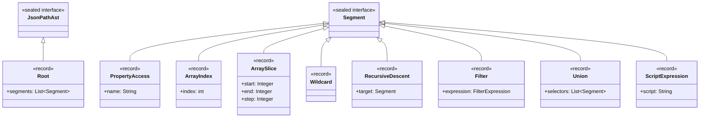
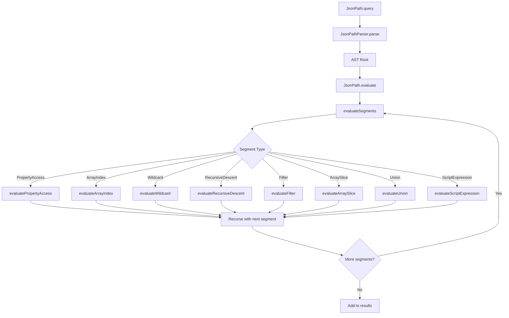

# JsonPath Module Architecture

## Overview

This module implements a JsonPath query engine for the java.util.json Java 21 backport. It parses JsonPath expressions into an AST (Abstract Syntax Tree) and evaluates them against JSON documents parsed by the core library.

**Key Design Principles:**
- **No external dependencies**: Only uses java.base
- **Pure TDD development**: Tests define expected behavior before implementation
- **Functional programming style**: Immutable data structures, pure functions
- **Java 21 features**: Records, sealed interfaces, pattern matching

## JsonPath Specification

Based on the original JSONPath specification by Stefan Goessner:
https://goessner.net/articles/JsonPath/

### Supported Operators

| Operator | Description | Example |
|----------|-------------|---------|
| `$` | Root element | `$` |
| `.property` | Child property access | `$.store` |
| `['property']` | Bracket notation property | `$['store']` |
| `[n]` | Array index (supports negative) | `$.book[0]`, `$.book[-1]` |
| `[start:end:step]` | Array slice | `$.book[:2]`, `$.book[::2]` |
| `[*]` or `.*` | Wildcard (all children) | `$.store.*`, `$.book[*]` |
| `..` | Recursive descent | `$..author` |
| `[n,m]` | Union of indices | `$.book[0,1]` |
| `['a','b']` | Union of properties | `$.store['book','bicycle']` |
| `[?(@.prop)]` | Filter by existence | `$..book[?(@.isbn)]` |
| `[?(@.prop op value)]` | Filter by comparison | `$..book[?(@.price<10)]` |
| `[(@.length-1)]` | Script expression | `$..book[(@.length-1)]` |

### Comparison Operators

| Operator | Description |
|----------|-------------|
| `==` | Equal |
| `!=` | Not equal |
| `<` | Less than |
| `<=` | Less than or equal |
| `>` | Greater than |
| `>=` | Greater than or equal |

## Module Structure

```
json-java21-jsonpath/
├── src/main/java/json/java21/jsonpath/
│   ├── JsonPath.java           # Public API facade
│   ├── JsonPathAst.java        # AST definition (sealed interface + records)
│   ├── JsonPathParser.java     # Recursive descent parser
│   └── JsonPathParseException.java  # Parse error exception
└── src/test/java/json/java21/jsonpath/
    ├── JsonPathLoggingConfig.java   # JUL test configuration
    ├── JsonPathAstTest.java         # AST unit tests
    ├── JsonPathParserTest.java      # Parser unit tests
    └── JsonPathGoessnerTest.java    # Goessner article examples
```

## AST Design

The AST uses a sealed interface hierarchy with record implementations:



## Evaluation Flow



## Usage Example

```java
import jdk.sandbox.java.util.json.*;
import json.java21.jsonpath.JsonPath;

// Parse JSON
JsonValue json = Json.parse("""
    {
      "store": {
        "book": [
          {"title": "Book 1", "price": 8.95},
          {"title": "Book 2", "price": 12.99}
        ]
      }
    }
    """);

// Query authors of all books
List<JsonValue> titles = JsonPath.query("$.store.book[*].title", json);

// Query books cheaper than 10
List<JsonValue> cheapBooks = JsonPath.query("$.store.book[?(@.price<10)]", json);

// Query all prices recursively
List<JsonValue> prices = JsonPath.query("$..price", json);
```

## Testing

Run all JsonPath tests:

```bash
$(command -v mvnd || command -v mvn || command -v ./mvnw) test -pl json-java21-jsonpath -Djava.util.logging.ConsoleHandler.level=INFO
```

Run specific test with debug logging:

```bash
$(command -v mvnd || command -v mvn || command -v ./mvnw) test -pl json-java21-jsonpath -Dtest=JsonPathGoessnerTest -Djava.util.logging.ConsoleHandler.level=FINE
```

## Limitations

1. **Script expressions**: Limited support - only `@.length-1` pattern
2. **Logical operators in filters**: `&&`, `||`, `!` - implemented but not extensively tested
3. **Deep nesting**: May cause stack overflow on extremely deep documents
4. **Complex scripts**: No general JavaScript/expression evaluation

## Performance Considerations

1. **Recursive evaluation**: Uses Java call stack for segment traversal
2. **Result collection**: Results collected in ArrayList during traversal
3. **No caching**: Each query parses the path fresh
4. **Defensive copies**: AST records create defensive copies for immutability
