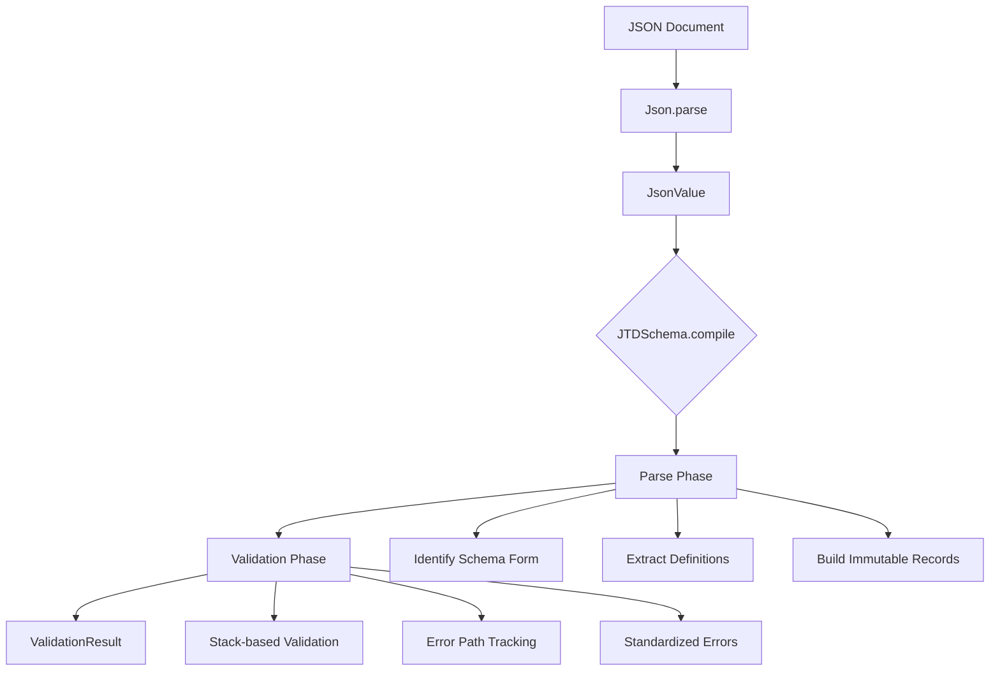
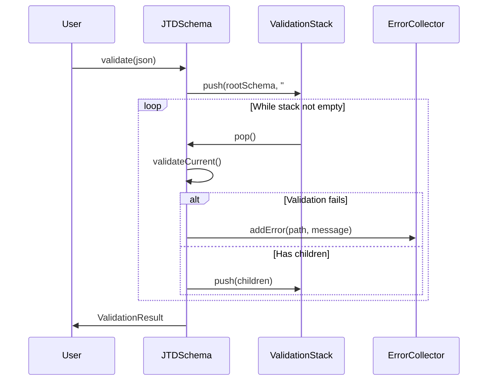
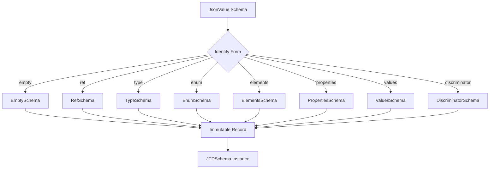

# JSON Type Definition (JTD) Validator Architecture

## Overview

This module implements a JSON Type Definition (JTD) validator based on RFC 8927. JTD is a schema language for JSON designed for code generation and portable validation with standardized error indicators. Unlike JSON Schema, JTD uses eight mutually-exclusive forms that make validation simpler and more predictable.

**Key Architectural Principles:**
- **Simpler than JSON Schema**: Eight mutually-exclusive forms vs. complex combinatorial logic
- **Immutable Design**: All schema types are records, validation is pure functions
- **Stack-based Validation**: Explicit validation stack for error path tracking
- **RFC 8927 Compliance**: Strict adherence to the specification
- **Performance Focused**: Minimal allocations, efficient validation paths

## JTD Schema Forms (RFC 8927 Section 2.2)

JTD defines eight mutually-exclusive schema forms:

1. **empty** - Validates any JSON value (RFC 8927 §2.2.1)
2. **ref** - References a definition in the schema (RFC 8927 §2.2.2)
3. **type** - Validates primitive types (RFC 8927 §2.2.3)
4. **enum** - Validates against a set of string values (RFC 8927 §2.2.4)
5. **elements** - Validates homogeneous arrays (RFC 8927 §2.2.5)
6. **properties** - Validates objects with required/optional fields (RFC 8927 §2.2.6)
7. **values** - Validates objects with homogeneous values (RFC 8927 §2.2.7)
8. **discriminator** - Validates tagged unions (RFC 8927 §2.2.8)

## Architecture Flow



## Core API Design

Following modern Java patterns, we use a single public sealed interface with package-private record implementations:

```java
package io.github.simbo1905.json.jtd;

import jdk.sandbox.java.util.json.*;

public sealed interface JTDSchema 
    permits JTDSchema.EmptySchema,
            JTDSchema.RefSchema,
            JTDSchema.TypeSchema,
            JTDSchema.EnumSchema,
            JTDSchema.ElementsSchema,
            JTDSchema.PropertiesSchema,
            JTDSchema.ValuesSchema,
            JTDSchema.DiscriminatorSchema {

    /// Compile JTD schema from JSON
    static JTDSchema compile(JsonValue schemaJson) {
        // Parse and build immutable schema hierarchy
    }
    
    /// Validate JSON document against schema
    default ValidationResult validate(JsonValue json) {
        // Stack-based validation
    }
    
    /// Schema type records (package-private)
    record EmptySchema() implements JTDSchema {}
    record RefSchema(String ref) implements JTDSchema {}
    record TypeSchema(PrimitiveType type) implements JTDSchema {}
    record EnumSchema(Set<String> values) implements JTDSchema {}
    record ElementsSchema(JTDSchema elements) implements JTDSchema {}
    record PropertiesSchema(
        Map<String, JTDSchema> properties,
        Map<String, JTDSchema> optionalProperties,
        boolean additionalProperties
    ) implements JTDSchema {}
    record ValuesSchema(JTDSchema values) implements JTDSchema {}
    record DiscriminatorSchema(
        String discriminator,
        Map<String, JTDSchema> mapping
    ) implements JTDSchema {}
    
    /// Validation result
    record ValidationResult(boolean valid, List<ValidationError> errors) {}
    record ValidationError(String instancePath, String schemaPath, String message) {}
}
```

## Type System (RFC 8927 Section 2.2.3)

JTD supports these primitive types, each with specific validation rules:

```java
enum PrimitiveType {
    BOOLEAN,
    FLOAT32, FLOAT64,
    INT8, UINT8, INT16, UINT16, INT32, UINT32,
    STRING,
    TIMESTAMP
}
```

**Architectural Impact:**
- **No 64-bit integers** (RFC 8927 §2.2.3.1): Simplifies numeric validation
- **Timestamp format** (RFC 8927 §2.2.3.2): Must be RFC 3339 format
- **Float precision** (RFC 8927 §2.2.3.3): Separate validation for 32-bit vs 64-bit

## Validation Architecture



## Error Reporting (RFC 8927 Section 3.2)

JTD specifies standardized error format with:
- **instancePath**: JSON Pointer to failing value in instance
- **schemaPath**: JSON Pointer to failing constraint in schema

```java
record ValidationError(
    String instancePath,  // RFC 8927 §3.2.1
    String schemaPath,    // RFC 8927 §3.2.2  
    String message        // Human-readable error description
) {}
```

## Compilation Phase



## Definitions Support (RFC 8927 Section 2.1)

JTD allows schema definitions for reuse via `$ref`:

```java
record CompiledSchema(
    JTDSchema root,
    Map<String, JTDSchema> definitions  // RFC 8927 §2.1
) {}
```

**Constraints** (RFC 8927 §2.1.1):
- Definitions cannot be nested
- Only top-level definitions allowed
- References must resolve to defined schemas

## Simplifications vs JSON Schema

| Aspect | JTD (This Module) | JSON Schema |
|--------|-------------------|-------------|
| Schema Forms | 8 mutually exclusive | 40+ combinable keywords |
| References | Simple `$ref` to definitions | Complex `$ref` with URI resolution |
| Validation Logic | Exhaustive switch on sealed types | Complex boolean logic with allOf/anyOf/not |
| Error Paths | Simple instance+schema paths | Complex evaluation paths |
| Remote Schemas | Not supported | Full URI resolution |
| Type System | Fixed primitive set | Extensible validation keywords |

## Implementation Strategy

### Phase 1: Core Types
1. Define sealed interface `JTDSchema` with 8 record implementations
2. Implement `PrimitiveType` enum with validation logic
3. Create `ValidationError` and `ValidationResult` records

### Phase 2: Parser
1. Implement schema form detection (mutually exclusive check)
2. Build immutable record hierarchy from JSON
3. Handle definitions extraction and validation

### Phase 3: Validator  
1. Implement stack-based validation engine
2. Add error path tracking (instance + schema paths)
3. Implement all 8 schema form validators

### Phase 4: Testing
1. Unit tests for each schema form
2. Integration tests with RFC examples
3. Error case validation
4. Performance benchmarks

## Usage Example

```java
import jdk.sandbox.java.util.json.*;
import io.github.simbo1905.json.jtd.JTDSchema;

// Compile JTD schema
String schemaJson = """
{
  "properties": {
    "id": { "type": "string" },
    "name": { "type": "string" },
    "age": { "type": "int32" }
  },
  "optionalProperties": {
    "email": { "type": "string" }
  }
}
""";

JTDSchema schema = JTDSchema.compile(Json.parse(schemaJson));

// Validate JSON
String json = """
{"id": "123", "name": "Alice", "age": 30, "email": "alice@example.com"}
""";

JTDSchema.ValidationResult result = schema.validate(Json.parse(json));

if (!result.valid()) {
    for (var error : result.errors()) {
        System.out.println(error.instancePath() + ": " + error.message());
    }
}
```

## Testing

Run the official JTD Test Suite:

```bash
# Run all JTD spec compliance tests
$(command -v mvnd || command -v mvn || command -v ./mvnw) test -pl json-java21-jtd -Dtest=JtdSpecIT
```

## Performance Considerations

1. **Immutable Records**: Zero mutation during validation
2. **Stack-based Validation**: Explicit stack vs recursion prevents StackOverflowError
3. **Minimal Allocations**: Reuse validation context objects
4. **Early Exit**: Fail fast on first validation error (when appropriate)
5. **Type-specific Validation**: Optimized paths for each primitive type

## Error Handling

- **Schema Compilation**: `IllegalArgumentException` for invalid schemas
- **Validation**: Never throws, returns `ValidationResult` with errors
- **Definitions**: Validate all definitions exist at compile time
- **Type Checking**: Strict RFC 8927 compliance for all primitive types

## Empty Schema Semantics

**RFC 8927 Strict Compliance**: The empty schema `{}` has specific semantics that differ from other JSON schema specifications:

- **RFC 8927 Meaning**: `{}` means an object with no properties allowed
- **Equivalent to**: `{ "properties": {}, "optionalProperties": {}, "additionalProperties": false }`
- **Valid Input**: Only `{}` (empty object)
- **Invalid Input**: Any object with properties

**Important Note**: Some JSON Schema and AJV implementations treat `{}` as "accept anything". This JTD validator is RFC 8927-strict and will reject documents with additional properties. An INFO-level log message is emitted when `{}` is compiled to highlight this semantic difference.

## RFC 8927 Compliance

This implementation strictly follows RFC 8927:
- ✅ Eight mutually-exclusive schema forms
- ✅ Standardized error format (instancePath, schemaPath)
- ✅ Primitive type validation (no 64-bit integers)
- ✅ Definition support (non-nested)
- ✅ Timestamp format validation (RFC 3339)
- ✅ No remote schema support (simplification by design)

## Future Extensions

Potential future additions (non-RFC compliant):
- Custom type validators
- Additional format validators  
- Remote definition support
- Performance optimizations for specific use cases