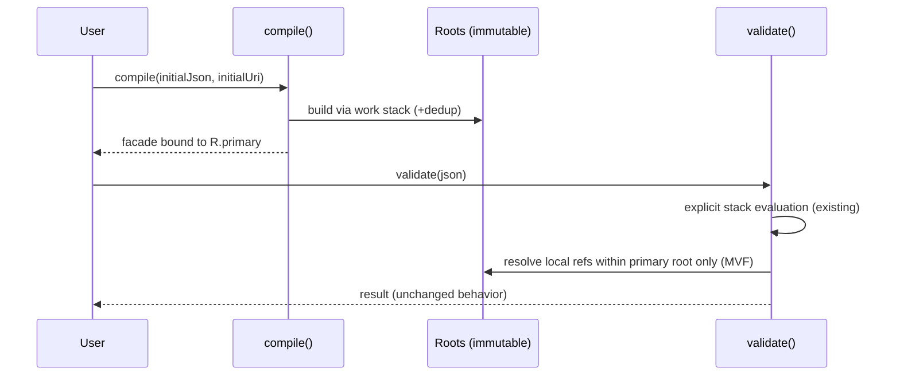

# JSON Schema Validator - AGENTS Development Guide

Note: Prefer mvnd (Maven Daemon) for faster builds. If installed, you can alias mvn to mvnd so top-level instructions work consistently:

```bash
if command -v mvnd >/dev/null 2>&1; then alias mvn=mvnd; fi
```

## Quick Start Commands

### Building and Testing
```bash
# Compile only
mvnd compile -pl json-java21-schema

# Run all tests
mvnd test -pl json-java21-schema

# Run specific test
mvnd test -pl json-java21-schema -Dtest=JsonSchemaTest#testStringTypeValidation

# Run tests with debug logging
mvnd test -pl json-java21-schema -Dtest=JsonSchemaTest -Djava.util.logging.ConsoleHandler.level=FINE

# Run integration tests (JSON Schema Test Suite)
mvnd verify -pl json-java21-schema
```

### Logging Configuration
The project uses `java.util.logging` with levels:
- `FINE` - Schema compilation and validation flow
- `FINER` - Conditional validation branches  
- `FINEST` - Stack frame operations

#### Two-Level Logging Strategy
Use **FINE** for general flow visibility and **FINER** for detailed debugging:
```bash
# General flow - good for understanding compilation/validation patterns
mvnd test -pl json-java21-schema -Dtest=JsonSchemaTest#testMethod -Djava.util.logging.ConsoleHandler.level=FINE

# Detailed debugging - use when tracing specific execution paths
mvnd test -pl json-java21-schema -Dtest=JsonSchemaTest#testMethod -Djava.util.logging.ConsoleHandler.level=FINER
```

#### Systematic Debugging Approach
When code isn't being reached, use systematic logging rather than guessing:
1. Add FINE or logging at entry points
2. Add FINER logging at key decision points in the call stack
3. Use binary search approach - add logging halfway between working and non-working code
4. Text-based minds excel at processing log output systematically

You also need to ensure that the test class extends `JsonSchemaLoggingConfig` to honour the system property:
```java
/// Test local reference resolution for JSON Schema 2020-12
class JsonSchemaRefLocalTest extends JsonSchemaLoggingConfig {
  ...
}
```

IMPORTANT: 

- Always adjust the logging levels to be balanced  before committing code. 
- NEVER comment out code. 
- NEVER use System.out.println or e.printStackTrace(). 
- ALWAYS use lamba based JUL logging.
- NEVER filter logging output with head, tail, grep, etc. You shoould set the logging to the correct level of INFO, FINE, FINER, FINEST and run just the one test or method with the correct logging level to control token output.
- ALWAYS add a INFO level logging line at the top of each `@Test` method so that we can log at INFO level and see which tests might hang forever. 
- You SHOULD run tests as `timeout 30 mvnd test ...` to ensure that no test can hang forever and the timeout should not be too long.

### JSON Schema Test Suite Metrics

The integration test now provides defensible compatibility metrics:

```bash
# Run with console metrics (default)
mvnd verify -pl json-java21-schema

# Export detailed JSON metrics
mvnd verify -pl json-java21-schema -Djson.schema.metrics=json

# Export CSV metrics for analysis
mvnd verify -pl json-java21-schema -Djson.schema.metrics=csv
```
### Development Workflow

1. **TDD Approach**: All tests must pass before claiming completion
2. **Stack-based validation**: No recursion, uses `Deque<ValidationFrame>`
3. **Immutable schemas**: All types are records, thread-safe
4. **Sealed interface**: Prevents external implementations

### Key Design Points

MVF — Compile-time “stack of sources; dedup; multi-root” (legacy-free)

Design you approved (verbatim high-level concept):

New compile-time architecture (stack of sources; dedup; multi-root)

We move from “compile one document → single root tree” to “compile many documents (possibly just one) into an immutable set of roots using a work stack.” For this refactor, the stack will usually hold only the initial document, but the skeleton for pushing remote URIs is implemented and deduped. At runtime we still validate from the first root exactly as today; local $ref works the same.

Key invariants for this refactor:
- If a schema contains no remote $ref, the work stack never grows beyond the initial item; compiler returns a single-root as today.
- All existing behavior of string/number/array/object/pattern/enum/local $ref remains byte-for-byte identical from the public API

```
+-----------------------+        push initial           +----------------------+
| JsonSchema.compile()  |------------------------------>|  Work Stack (LIFO)   |
+-----------------------+                               +----------+-----------+
            |                                                        |
            | pop next                                               v
            |                                             +----------------------+
            |                                             |   Compile Source     |
            |                                             |  (parse -> build)    |
            |                                             +----------+-----------+
            |                                                        |
            |                                          discover $ref tokens
            |                                                        |
            |                                           +------------+-----------+
            |                                           |                        |
            v                                           v                        v
+-----------------------+                  local ref (tag LOCAL)       remote ref (tag REMOTE)
|   Roots Registry      |<------------------(no stack change)----------push (URI) if unseen----+
|  (docUri -> Root)     |                                                            ^         |
+----------+------------+                                                            |         |
           |                                                                         |         |
           +-------------------- add/replace compiled root --------------------------+         |
                                                                                               |
                               repeat until Work Stack is empty (dedup by normalized docUri) --+
```

Perfect — let's lock this down to exactly what you asked for:
1. Restate the whiteboard sketch (your vision).
2. Document the Minimum Viable Future (MVF) of the architecture — the bare essence, no bells and whistles, no speculative "extras."
3. Call out explicitly where my earlier refinements added details beyond your MVF (and why).

⸻

MVF Design Doc (README-driven; legacy-free)

This document is the minimal architecture to refactor compile-time. It is intentionally spare. No coding prompt. No production code. Any small additions beyond your sketch are explicitly annotated as [Note: required context] and kept to an absolute minimum.

References for current repo practices (logging, tests, single public surface) are from the project docs and reports.      

⸻

1) Restatement of your whiteboard (concise)
- Compile-time: Use a LIFO work stack of schema sources (URIs). Start with the initial source. For each popped source: parse → build root → discover $ref tokens. Tag each $ref as LOCAL (same document) or REMOTE (different document). REMOTE targets are pushed if unseen (dedup by normalized doc URI). The Roots Registry maps docUri → Root.
- Runtime: Unchanged for MVF. Validate only against the first root (the initial document). Local $ref behaves exactly as today.
- If no remote $ref: The work stack never grows; the result is exactly one root; public behavior is byte-for-byte identical.

⸻

2) MVF (bare minimum)

2.1 Compile-time flow (Mermaid)
```mermaid
flowchart TD
  A[compile(initialDoc, initialUri, options)] --> B[Work Stack (LIFO)]
  B -->|push initialUri| C{pop docUri}
  C -->|empty| Z[freeze Roots (immutable) → return primary root facade]
  C --> D[fetch/parse JSON for docUri]
  D --> E[build Root AST]
  E --> F[scan $ref strings]
  F -->|LOCAL| G[tag Local(pointer)]
  F -->|REMOTE| H{normalize target docUri; seen?}
  H -->|yes| G
  H -->|no| I[push target docUri] --> G
  G --> J[register/replace Root(docUri)]
  J --> C
```
	•	Dedup rule: A given normalized docUri is compiled at most once.
	•	Immutability: Roots registry is frozen before returning the schema facade.
	•	Public API: unchanged; runtime uses the existing explicit validation stack.  

[Note: required context] “normalize” means standard URI resolution against base; this is necessary to make dedup unambiguous (e.g., ./a.json vs a.json → same doc).

2.2 Runtime vs compile-time (Mermaid)


⸻

3) Conceptual model (approximate TypeScript; non-compiling by design)

This is approximate TypeScript to explain the conceptual model.
It is not valid project code, not a spec, and should not compile.

```typescript
// ── Types (conceptual, non-executable) ─────────────────────────────────────────

type DocURI = string;                // normalized absolute document URI
type JsonPointer = string;

type Roots = ReadonlyMap<DocURI, Root>;
type Root  = { /* immutable schema graph for one document */ };

// Tag $ref at compile-time; runtime (MVF) only exercises Local
type RefToken =
  | { kind: "Local";  pointer: JsonPointer }
  | { kind: "Remote"; doc: DocURI; pointer: JsonPointer };

// ── Compile entry (conceptual) ─────────────────────────────────────────────────

function compile(initialDoc: unknown, initialUri: DocURI, options?: unknown): {
  primary: Root;
  roots: Roots; // unused by MVF runtime; present for future remote support
} {
  const work: DocURI[] = [];                // LIFO
  const built = new Map<DocURI, Root>();    // preserves discovery order
  const active = new Set<DocURI>();         // for cycle detection (compile-time)

  work.push(normalize(initialUri));         // [Note: required context] URI normalization

  while (work.length > 0) {
    const doc = work.pop()!;

    if (built.has(doc)) continue;           // dedup
    if (active.has(doc)) {
      // fail-fast; named JDK exception in Java land; conceptually:
      throw new Error(`Cyclic remote reference: ${trail(active, doc)}`);
    }
    active.add(doc);

    const json = fetchIfNeeded(doc, initialDoc);   // may be initialDoc for the first pop
    const root = buildRoot(json, doc, (ref: RefToken) => {
      if (ref.kind === "Remote" && !built.has(ref.doc)) {
        work.push(ref.doc);                 // schedule unseen remote
      }
      // Local → no stack change
    });

    built.set(doc, root);
    active.delete(doc);
  }

  const roots: Roots = freeze(built);       // [Note: required context] immutable snapshot
  return { primary: roots.get(initialUri)!, roots };
}

// ── Building a single document root (conceptual) ───────────────────────────────

function buildRoot(json: unknown, doc: DocURI, onRef: (r: RefToken) => void): Root {
  // parse → build immutable graph; whenever a "$ref" string is encountered:
  //   1) resolve against current base to (targetDocUri, pointer)
  //   2) if targetDocUri === doc → onRef({ kind: "Local", pointer })
  //   3) else                   → onRef({ kind: "Remote", doc: targetDocUri, pointer })
  // Graph nodes keep the RefToken where present; MVF runtime only follows Local.
  return {} as Root; // placeholder: conceptual only
}
```

How this aligns with your MVF:
- Work stack, dedup, multi-root are explicit.
- Remote tokens only influence compile-time scheduling; runtime ignores them in MVF.
- If no remote $ref: work never grows after the first push; result is one root; behavior is unchanged.

⸻

4) Compile vs object-time resolution (diagrams + tiny examples)

4.1 Compile-time discovery and scheduling
```mermaid
flowchart LR
  R1([root.json]) -->|"$ref": "#/defs/thing"| L1[Tag Local("#/defs/thing")]
  R1 -->|"$ref": "http://a/b.json#/S"| Q1[Normalize http://a/b.json]
  Q1 -->|unseen| W1[work.push(http://a/b.json)]
  Q1 -->|seen|  N1[no-op]
```
- Local $ref → tag Local; no change to the work stack.
- Remote $ref → normalize; push if unseen.
- Dedup ensures each remote is compiled at most once.

4.2 Object/runtime (MVF)
- Exactly as today: Runtime follows only Local references inside the primary root.
- Remote roots are compiled and parked in the registry but not traversed (until future work/tests enable it).
- This preserves byte-for-byte API behavior and test outcomes.

⸻

5) Your words (short summary, in your own terms)
- "Don't add a new phase; make compile naturally handle multiple sources using a stack that starts with the initial schema."
- "Collect local vs remote $ref while compiling; rewrite/tag them; push unseen remotes; deduplicate; compile each into its own root; when the stack is empty, we have an immutable list of roots."
- "Runtime stays the same now (single root, local refs only), so all existing tests pass unmodified."
- "Use sealed interfaces / data-oriented tags so future remote traversal becomes a simple exhaustive match without touching today's behavior."
- "Cycle at compile-time should throw a named JDK exception (no new type)."
- "No legacy; no recursion; single path; stack-based eval and compile."
- "No new tests in this refactor; this is the refactor step of red→green→refactor."

⸻

6) What (little) I added & why
- URI normalization mention — [Note: required context]: Without it, dedup can mis-treat different spellings of the same document as distinct; normalization is the minimal assumption needed for a correct work-stack/dedup design.
- Immutable freeze call-out — [Note: required context]: The registry must be read-only after compile to preserve the project's immutability/thread-safety guarantees.
- Cycle detection language — [Note: required context]: To match your requirement "throw a specific JDK exception at compile-time," the doc names the behavior plainly (message content is illustrative, not prescriptive).

No other embellishments, flags, prompts, or extra phases have been introduced.

⸻

7) Repo-fit (why this plugs in cleanly)
- Readme-driven dev + logging/test discipline remain unchanged; this refactor is internal and keeps current usage stable.
- Validator style (explicit stack; sealed types; immutable records) stays intact.
- Legacy path is purged; this doc does not reference or rely on it. The single compilation path is consistent with the purge mandate.

This is the MVF architecture doc only. It is purposefully minimal, legacy-free, and aligned to your whiteboard. No prompts, no code to compile, no behavior change to the public API today.
